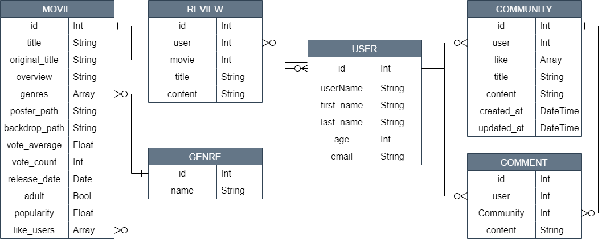
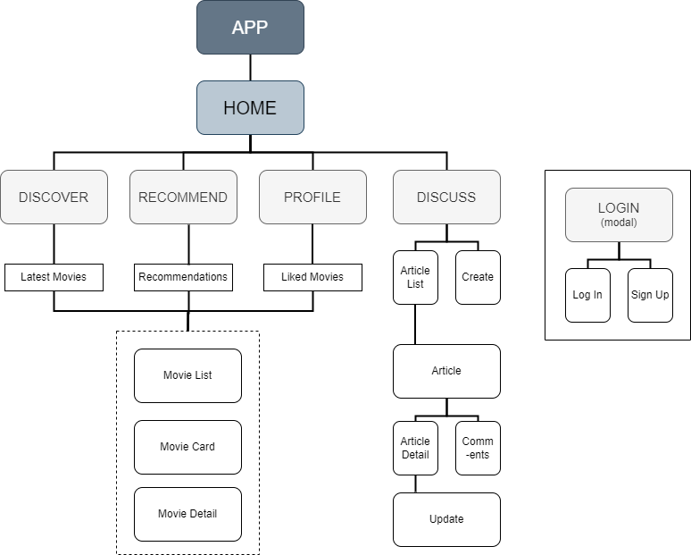
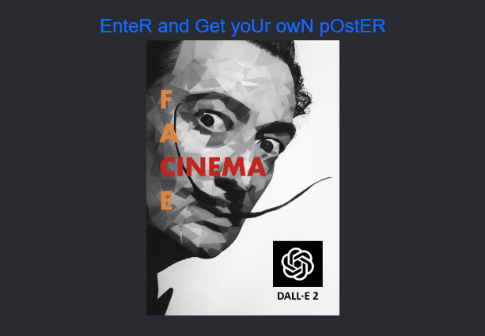
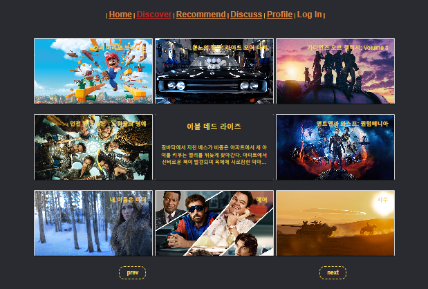
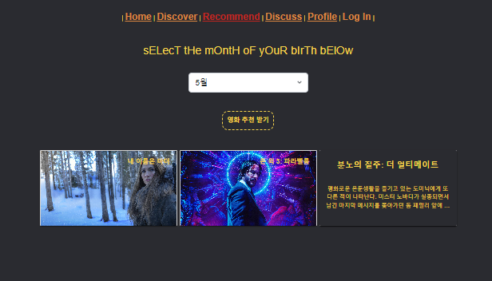
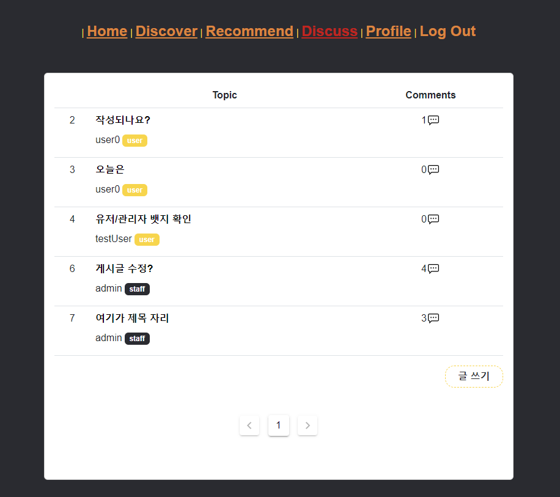
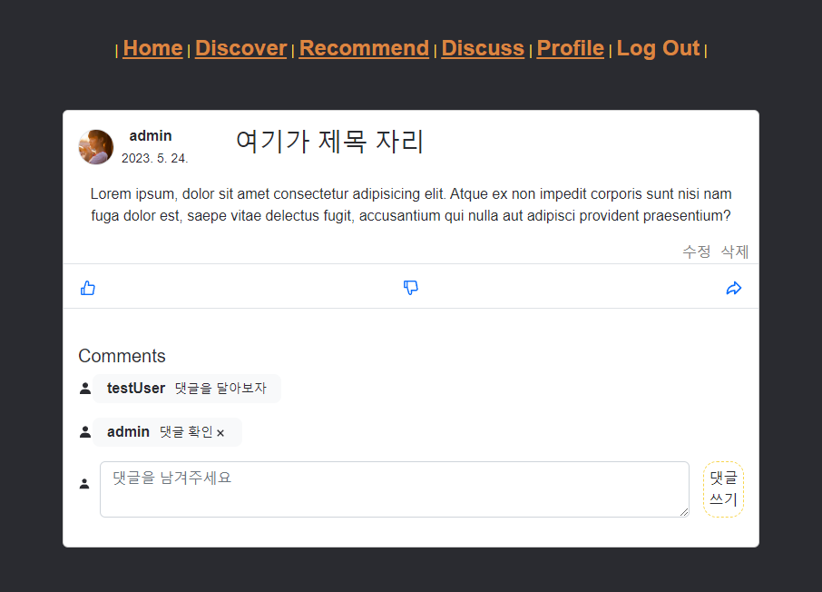
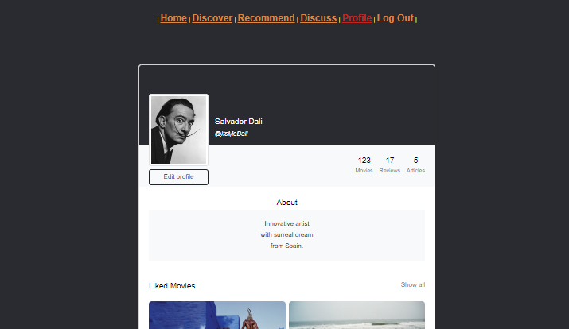
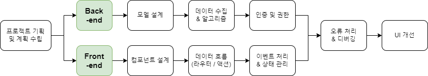

# Project: Movie

### Overview

사용자에게 인기 영화 정보를 제공하고, 특별한 날과 관련된 새로운 영화를 추천해주는 웹 어플리케이션

- Tech Stack
<div>
    
    
    
    
    
    
    
    
    
</div>

- 설계패턴  
  MVVM

- 진행 기간  
  23.05.16 - 23.05.26

### 팀원 및 업무 분담 내역

|  이름  |    역할    | 세부 기능                                                              |
| :----: | :--------: | :--------------------------------------------------------------------- |
| 김은비 | 프론트엔드 | - 컴포넌트 구조 설계<br>- 데이터 통신<br>- UX 개선<br>                 |
| 김남우 |   백엔드   | - 데이터 모델 설계<br> - 데이터 수집 및 저장 <br> - 추천 알고리즘 설계 |
|  공통  |     -      | - 인증 및 권한 관리<br>- 프로젝트 디자인<br>                           |

### 목표 서비스 및 실제 구현 정도

- [x] 최신 인기 영화 정보 제공
- [x] 좋아하는 영화 목록 저장 및 조회
- [x] 월별 추천 영화
- [ ] 사용자 이미지 합성 포스터 제공  
      &nbsp;특별한 날(ex. 생일)에 개봉한 혹은 1위를 한 영화와 프로필 사진을 합성
- [x] 자유 게시판
- [ ] JWT token을 사용한 사용자 관리
- [x] 회원 가입 및 로그인
- [ ] 소셜 로그인
      <br>
      <br>

### 서비스 구현 리뷰

**1. 날짜 기반 영화 추천 및 사용자 이미지 합성 포스터 제공**  
&emsp;사진 합성에 활용하기로 한 DALL·E API는 오픈 소스로 제공되지만, 합성을 하기 위한 비용과 약 2분 정도의 시간이 발생한다. 합성 시간 동안 광고를 게시하여 비용을 상쇄하는 것이 가능하다고 생각했으나 시간 내에 얻을 수 있는 광고 수익이 비용보다 적다는 문제점이 있었다.  
&emsp;또한 회원가입 시 입력받은 사용자의 생일이나 별도로 입력받은 특별한 날짜와 관련된 영화 추천은, 추천 영화 알고리즘 상 입력 수치만 바꾸어 TMDB API에 요청만 하면 되어서 문제될 점은 없었다. 하지만 이 기능을 구현하기 위한 Database의 규모가 프로젝트의 규모에 비해 너무 크고, 최초 DB의 로딩 시간이 길어진다는 단점이 발생했다. 따라서 프로젝트의 규모와 사용자 경험을 고려했을 때 월별 추천 영화를 제공하는 것으로 서비스를 수정했다.

**2. JWT token**  
&emsp;dj-rest-auth에서 제공하는 기본 토큰이 보안상 취약하다는 단점을 보완하기 위해 simple jwt의 사용을 시도했다. 이후 프론트엔드에서 회원가입/로그인 시 유저가 발급받은 토큰을 헤더에 넣어 요청을 보냈으나 계속해서 토큰이 없어 유효하지 않은 요청이라는 오류가 발생했다. 디버깅 결과 발급받은 토큰이 요구되는 형식과 맞지 않음을 알 수 있었고, 토큰의 형식을 바꿔주기 위한 노력을 했으나 시간 내에 해결하는 데에 어려움이 있었다. 따라서 기본 토큰을 활용하고 다른 기능을 먼저 구현하는 방향으로 진행했다.

**3. 소셜 로그인**  
&emsp;구글 로그인을 구현하기 위해 외부 라이브러리를 설치했다. 구글에서 제공하는 로그인 창을 띄우는 것에는 성공했으나, 현재 구글에서 해당 버전을 지원하지 않게 된 관계로 데이터를 전달하는 과정에서 오류가 발생했다. 해당 오류는 라이브러리가 아닌 다른 방법으로 관련 API를 호출해 추후 해결할 예정이다.

<br>
<br>

### 데이터베이스 모델링(ERD)


<br>
<br>

### 컴포넌트 구조


<br>
<br>

### 주요 기능 및 알고리즘 설명

**1. Home**  
어플리케이션 입장 시 백 서버의 API 함수를 호출 해 실행, 다음 화면에서 보여 줄 DB를 내부 서버에 생성  
  
**2. Discover**  
만들어진 DB로부터 데이터를 받아와 화면을 구성하여 1주일간 가장 인기있었던 영화 목록을 제공  
2-1. 각 영화에 마우스오버 시 추가 정보 표시, 클릭 시 상세 페이지로 이동  
2-2. 영화 상세 정보 제공 및 로그인 한 사용자에 한해 '좋아요' 등의 기능 구현  


**3. Recommend**  
사용자가 원하는 달을 입력받아 그 달에 개봉한 영화 중 현재 인기있는 영화를 랜덤으로 최대 3개까지 보여준다.

```python
@api_view(['GET'])
def recommend(request, month):
    # 사용자로부터 입력받은 월(예: 3)의 영화 목록을 필터링
    movies = Movie.objects.filter(release_date__month=month)
    # 랜덤하게 3개의 영화 선택
    if len(list(movies)) >= 3:
        random_movies = sample(list(movies), 3)
    else:
        random_movies = list(movies)
    # 직렬화된 형식으로 응답
    serializer = MovieSerializer(random_movies, many=True)
    return Response(serializer.data)
```

  
**4. Discuss**  
로그인한 사용자에 한하여 게시판 기능 사용 가능  
간단한 게시글과 댓글 작성/수정/삭제 기능 제공  
  
  
**5. Profile**  
회원 정보 열람 및 수정
'좋아요'한 영화 목록 확인


<br>
<br>

## 프로젝트 진행 과정


<br>
<br>

## 프로젝트를 통해 배운 점

**1. 기획의 중요성**  
&emsp;데이터 모델과 컴포넌트 구조는 코드를 작성하고 나면 수정하기 어렵다. 사이트의 페이지를 세세히 구성해 놓지 않아 중간에 새로운 데이터 필드가 필요한 경우가 생겨서 모델 구조와 관계를 재설정하는 데에 어려움이 있었다. 프론트의 컴포넌트도 그 구조나 이름을 바꾸니 연결된 필드와 컴포넌트를 모두 수정해야하는 등 복잡한 일이 있었다. 기획 단계에서 최종 프로젝트의 결과가 어떻게 될 것 인지 미리 그려보고 그에 맞는 모델과 컴포넌트를 설계해 두는 것이 중요함을 느꼈다.

**2. 백-프론트 분업**  
&emsp;프로젝트의 기능을 나누어 작업하는 것보다 페어와의 소통의 기회가 많고 그 중요도가 높다. 클라이언트-서버 간에 많은 요청과 응답이 오고가는 만큼 오류 발생 시 문제점에 대해 전달하고, 진행 상황을 공유하는 것이 중요했다. 또한 각 파트를 전담했기 때문에 맡은 업무에 대한 이해도를 높일 수도 있었다.

**3. 디버깅**  
&emsp;마주치면 머리 아픈 빨간 글씨지만 사실 그 내용은 친절하다. 에러 메시지를 꼼꼼히 살펴 보며 어느 파일, 몇 번째 줄에서, 어떤 오류가 발생했는 지 파악할 수 있었다. 개발을 한다면 오류는 피할 수 없고, 심지어 강의 시간에 배운 코드를 붙여 넣어도 오류는 난다. 오류가 발생했을 때 문제가 발생한 지점부터 데이터의 흐름을 따라가보고, 각 단계별로 중간 출력값을 확인하여 차근차근 해결하는 과정을 겪으며 에러를 마주친 상황에서 어떻게 대처해야 하는 지 배울 수 있었다.

<br>

**번외. 모바일 개발자 지망생의 웹 프로젝트 후기**

&emsp;&emsp;: 개발자로서의 지향점과 그 성취를 위한 연습에 대한 고찰

&emsp;이번 프로젝트는 아이디어와 기획, UI/UX, 그리고 개발까지 전 단계를 직접 해보는 좋은 기회였다. 모든 것을 하다보니 전체 프로젝트의 통일성은 가져갈 수 있었지만, 잘 알지 못하는 부분도 담당하다 보니 오히려 전체적인 완성도가 떨어지는 것을 느꼈다. 그리고 웹 프레임 워크를 사용하는 데에 미숙함이 있어 최종 결과물의 만듦새나 세세한 기능 구현에서도 미흡한 점이 많았다. 그럼에도 불구하고 이 프로젝트를 통해 배운 점도 많은데, 내가 잘할 수 있는 분야를 특화시켜 발전시켜야겠다는 다짐과, 어플리케이션 구조 설계의 중요성이 그 일부이다.  
&emsp;코드를 짜다가 생소한 오류에 부딪히고, 생각대로 결과물이 나오지 않아 막막할 때면 검색 포털이나 개발자 커뮤니티를 찾아보는 것은 물론 요즘에는 AI 챗봇에게도 도움을 요청하는 경우가 많다. 특히 챗봇이 순식간에 짜주는 코드는 놀라울 정도여서, 앞으로의 개발자의 일자리가 위협당하고 있다는 기사도 쏟아지고 있다. 하지만 단순한 코드 작성법을 물어볼 때와는 달리 프로젝트 내에서 사용될 코드를 물어볼 때면 아직은 챗봇의 답변이 만족스럽지 않을 경우가 많은 것이 현실이다. 이는 챗봇이 프로젝트 전체를 총괄하며 필요한 코드를 적재적소에 쓸 수 있도록 알려주는 것이 아니라 요청받은 기능만을 지엽적으로 분석하고 이를 구현하는 법을 알려주기 때문이라고 생각한다. 결국 중요한 것은 특정 기능을 구현할 수 있느냐 없느냐가 아니라 어떻게 어플리케이션을 설계하고 각 구성요소마다 어떠한 기능을 부여할 것인지에 대해 고민하는 것이 아닐까.

&emsp;위와 같은 느낀 점을 바탕으로 이번 프로젝트인 Face Cinema부터 이를 모바일 어플리케이션으로 구현한다고 가정하고 구조를 설계해 보았다. 다음의 내용은 그 구조를 간단히 설명한 것이다.

> - MVC  
>   Model: 데이터 모델  
>   &emsp;&emsp;&emsp;- Account, Movie, Article이 동일하게 존재  
>   View: 특정 기능을 담당한다기 보다, 사용자의 입력을 Controller로 전달하고, 그 연산 결과를 다시 사용자에게 반환해주는 역할만 가진다.  
>   &emsp;&emsp;&emsp;- Model Manager의 delegate들을 가짐  
>   Controller: 연산과 데이터 가공 등 실질적 기능 구현의 중심  
>   &emsp;&emsp;&emsp;- 모델마다 그와 관련된 연산을 수행하는 Manager를 각각 정의하고, Network Manager(for TMDB), Auth Manager(for Firebase)를 따로 두어 외부 서버와 통신하는 역할을 분담. 모델과 관련되지 않은 Manager들은 받아온 데이터를 특정 쓰임새에 맞게 가공하는 것이 아니라 통신 그 자체로써 역할을 다함. (기능적 분리)
> - MVVM  
>   기능할 수 있는 작은 단위로 쪼갠 컴포넌트의 집합으로, 웹 프로젝트와 구조가 거의 동일함  
>   &emsp;&emsp;&emsp;- 데이터를 Observed Property(≒VueCli의 state), State 등 어떻게 구분하여 상태를 관리할 건지

&emsp;웹에서의 MTV, MVVM 패턴은 모바일의 MVC, MVVM에 각각 대응되는 데, 결국 어떤 패턴이던간에 웹과 모바일 모두 동일한 모델과 구조를 공유하는 것을 알 수 있었다. 어떤 컴퓨터 언어를 사용하는 지, 어떻게 기능을 구현할 수 있는 지는 사실 크게 중요하지 않다. 그렇기에 기능별, 혹은 컴포넌트별로 단위들을 사용해 각각의 재사용성을 높이고, 이를 통해 효과적이고 이해하기 쉬운 구조를 설계하는 연습이 필요함을 다시 한 번 알 수 있었다. 이러한 점에서 이번 프로젝트는 결과물의 형식을 떠나 개발자로서 성장할 수 있는 값진 경험이었다.

<br>
<br>

### 프로젝트 설치 및 실행

<details>
  <summary>자세히 보기</summary>
  1. 본 프로젝트 repository를 설치하고자 하는 시스템에 내려받기
  <div markdown="1">

    git clone https://github.com/yoon-b/Movie_Project.git

  </div>
  2. 환경 설정  
   
   2-1. 백엔드  
  &emsp;① 가상환경 설정 및 의존 패키지 설치
  <div markdown="1">

    > cd back-end
    > python -m venv venv
    > source venv/Scripts/activate
    > pip install -r requirements.txt

  </div>
  &emsp;② 모델 마이그레이션
  <div markdown="1">

    > python manage.py migrate

  </div>
  &emsp;③ 데이터베이스 생성하기 (택 1)

&emsp;&emsp;a. TMDB API 설정

  <div markdown="1">

    tmdb_api_key=YOUR_API_KEY

  </div>
  &emsp;&emsp;b. fixtures 불러오기
  <div markdown="1">

    > python manage.py loaddata movies.json genres.json

  </div>

&emsp;④ 서버 실행

  <div markdown="1">

    > python manage.py runserver

  </div>
  <div>
   2-2. 프론트엔드  
  &emsp;의존 패키지 설치 및 서버 실행
  <div markdown="1">

    > cd final-pjt-front
    > npm install
    > npm run serve

  </div>

  </div>
</details>

<br>
<br>
